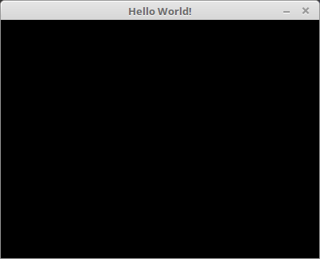
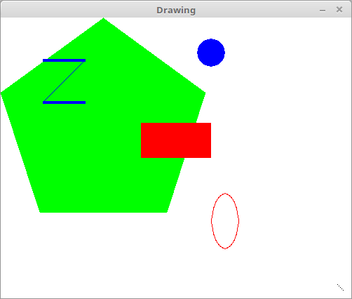
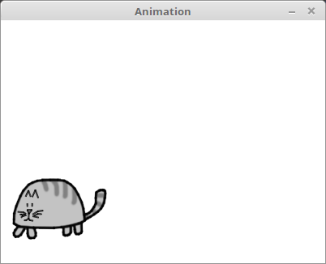

# Hello World with Pygame

Our first program made with Pygame is a small program that makes a window that says "Hello World!" appear on the screen.

# Drawing

Pygame provides several different function for drawing differet shapes onto a surface object. These shapes such as rectangles, circles, ellipses, lines or individual pixes are often called **drawing primitives**.

# Animation

Now that we know how to get the Pygame framework to draw to the screen, let's learn how to make animated pictures.

